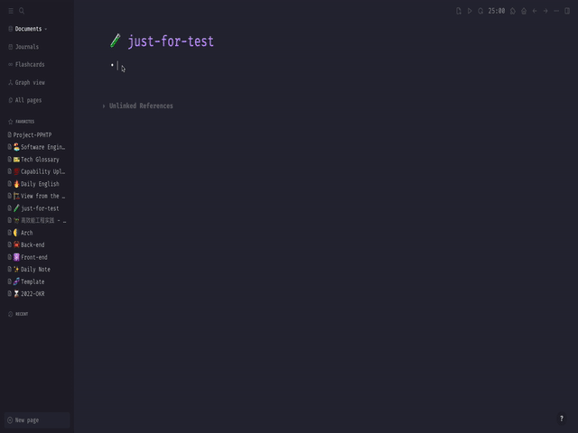

# Logseq-echarts

A plugin of logseq which integrates with [ECharts](https://echarts.apache.org/)

## Demo

### Screenshot

### Video

[bilibili](https://www.bilibili.com/video/BV1JD4y167eK/)

## Usage steps

- Search `logseq-echarts` in Logseq marketplace and install it
- Type `/Create a chart` command, the plugin will insert a demo chart
- Customize your chart via updating the echarts options code (**JSON format**)
